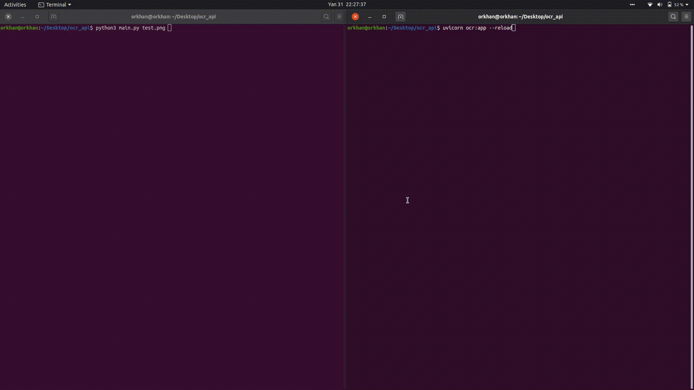

# OCR API
---

This repository is API based Optical Character Recognition.
<br>
<br>


## Really Simple :)
Just run the server and request to the server with any image file which contains characters. That's all :)

### Okay what is the workflow?
* You should install packages. (descripted inside of requirements.txt)
* Run the server for the requests
* Request to the server with the image
* Get your response and Enjoy :)

#### How can you install packages?

**NOTE:** Sometimes tesseract might be mischievous. If you are not own the tesseract you can run command below. 

```bash
$ sudo apt install tesseract-ocr
```
Then control your tesseract version with this:
``` bash
$ tesseract --version
```

After these steps everything will be the simplest. Just run command below.

``` bash
$ cd ocr_api/
$ pip3 install -r requirements.txt
```

#### You have installed those packeges, what you will do next?

Now you can run your server first.

``` bash
$ uvicorn ocr:app --reload
```
 Then you should be get the messages below:
 
``` bas
INFO:     Uvicorn running on http://127.0.0.1:8000 (Press CTRL+C to quit)
INFO:     Started reloader process [33226] using statreload
INFO:     Started server process [33228]
INFO:     Waiting for application startup.
INFO:     Application startup complete.
```

#### Let's try the server
For testing the server you can use _test.png_.

```bash
$ python3 main.py test.png
```
What is your response? Absolutely right!

Your output:

```
By default, Tesseract expects a page of text when it segments an image. If
you're just seeking to OCR a small region, try a different segmentation mode,
using the --psm argument. There are 14 modes available which can be found
here. By default, Tesseract fully automates the page segmentation but does
not perform orientation and script detection. To specify the parameter, type
the following:
```

